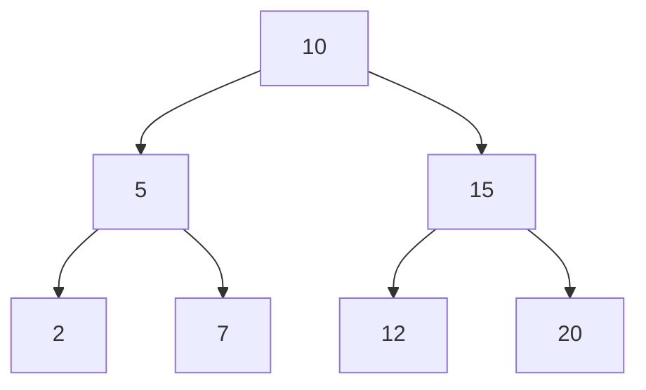

# Binary Search Tree (BST) in Go

This project implements a generic Binary Search Tree (BST) in Go, providing basic operations such as insertion, deletion, search, and traversal. The project also includes unit tests to ensure the correctness of the implementation.



## Table of Contents

- [Installation](#installation)
- [Usage](#usage)
- [API](#api)
  - [BST](#bst)
  - [Node](#node)
  - [CmpFn](#cmpfn)
- [Examples](#examples)
- [Testing](#testing)
- [Contributing](#contributing)
- [License](#license)

## Installation

To use this BST implementation in your Go project, you can simply clone this repository and import the `bst` package.

```sh
git clone https://github.com/yourusername/bst_go.git
```

Then, import the package in your Go code:

```go
import "path/to/your/repo/bst_go/bst"
```

## Usage

Here is a basic example of how to use the BST:

```go
package main

import (
	"fmt"
	"path/to/your/repo/bst_go/bst"
)

func main() {
	// Create a new BST
	bst := bst.NewBST(func(a, b int) int {
		return a - b
	})

	// Insert elements
	values := []int{3, 1, 4, 1, 5, 9, 2, 6, 5, 3, 5}
	for _, v := range values {
		bst.Insert(v)
	}

	// Search for elements
	if _, ok := bst.Search(3); ok {
		fmt.Println("Value 3 found in BST")
	} else {
		fmt.Println("Value 3 not found in BST")
	}

	// Remove elements
	if ok := bst.Remove(1); ok {
		fmt.Println("Value 1 removed from BST")
	} else {
		fmt.Println("Value 1 not found in BST")
	}

	// Perform in-order traversal
	bst.InOrder(func(value int) {
		fmt.Print(value, " ")
	})
	fmt.Println()
}
```

## API

### BST

The `BST` struct represents a binary search tree. It provides the following methods:

- `Insert(value T)`: Inserts a value into the BST.
- `Remove(value T) (ok bool)`: Removes a value from the BST. Returns `true` if the value was found and removed, `false` otherwise.
- `Search(value T) (T, ok bool)`: Searches for a value in the BST. Returns the value and `true` if found, `false` otherwise.
- `Size() uint`: Returns the number of elements in the BST.
- `Height() uint`: Returns the height of the BST.
- `InOrder(f func(T))`: Performs an in-order traversal of the BST, calling the provided function for each value.
- `PreOrder(f func(T))`: Performs a pre-order traversal of the BST, calling the provided function for each value.
- `PostOrder(f func(T))`: Performs a post-order traversal of the BST, calling the provided function for each value.
- `InOrderVec() []T`: Returns a slice of values in in-order traversal.
- `PreOrderVec() []T`: Returns a slice of values in pre-order traversal.
- `PostOrderVec() []T`: Returns a slice of values in post-order traversal.

### Node

The `Node` struct represents a node in the BST. It contains the following fields:

- `value T`: The value stored in the node.
- `left *Node[T]`: A pointer to the left child node.
- `right *Node[T]`: A pointer to the right child node.

### CmpFn

The `CmpFn` type represents a comparison function used to compare values in the BST. It is defined as:

```go
type CmpFn[T comparable] func(a, b T) int
```

## Examples

See the `main.go` file for a complete example of how to use the BST.

## Testing

To run the tests, use the following command:

```sh
go test ./...
```

The tests are located in the `bst_test.go` and `traversal_test.go` files.

## Contributing

Contributions are welcome! Please open an issue or submit a pull request.

## License

This project is licensed under the MIT License. See the [LICENSE](LICENSE) file for details.
